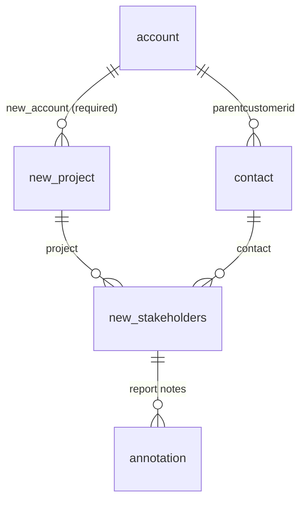
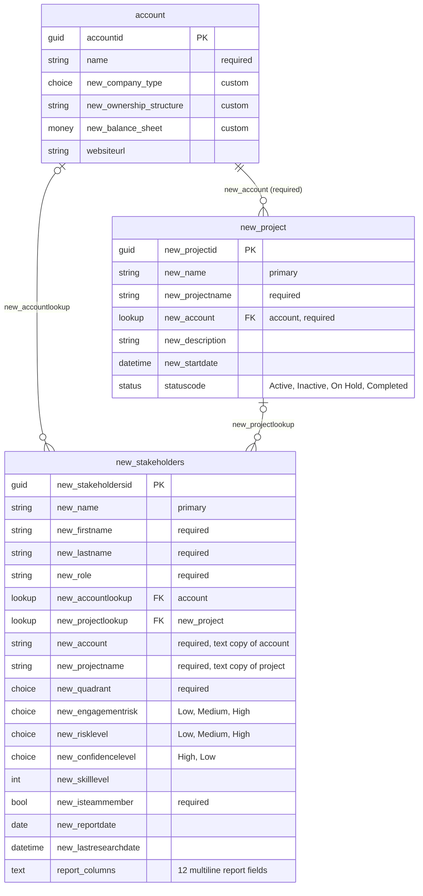

# Dataverse data model — solution "Stakeholders"

Environment `hackathon2-team2`, solution `Stakeholders` (publisher prefix `new_`).

## Target model (agreed 2026-09-25)

| Table | One row per | Holds |
|---|---|---|
| `account` (OOB) | customer | company data |
| `contact` (OOB) | person | identity only: name, job title, account, email — no profile content |
| `new_project` | project | name, account, dates, status |
| `new_stakeholders` — display name "Project Stakeholder" | person × project | contact, project, role in project, quadrant, engagement risk, confidence, report date, latest report HTML (for the canvas app) |
| `annotation` (Notes) | report run | dated HTML report attachment; history, never overwritten |

Front end: a Power Apps canvas app opened in Microsoft Teams by the PM. The report is
displayed with the HTML text control, so reports use inline styles only.
The model-driven app stays in the solution for now.

### Project Stakeholder columns (verified 2026-09-25)

| Schema name | Display name | Type | Required |
|---|---|---|---|
| `new_Name` | Name | Text, primary (system-generated schema name) | Yes |
| `new_contact` | Contact | Lookup → contact | Yes |
| `new_projectlookup` | Project | Lookup → new_project | Yes |
| `new_roleinproject` | Role in Project | Choice → global `new_roleinproject`: Decision Maker, Sponsor, Influencer, End User, Blocker, Project Team Member | No |
| `new_quadrant` | Quadrant | Choice → global `new_quadrant`: Manage Closely, Keep Satisfied, Keep Informed, Monitor, Not assessable | No |
| `new_engagementrisk` | Engagement Risk | Choice → global `new_engagementrisk`: Low, Medium, High, Not assessable | No |
| `new_confidencelevel` | Confidence Level | Choice → global `new_confidencelevel`: High, Medium, Low | No |
| `new_reportdate` | Report Date | Date only | No |
| `new_reporthtml` | Report HTML | Multiline text, 1,048,576 | No |

Global choices in the solution: `new_roleinproject`, `new_quadrant`, `new_engagementrisk`,
`new_confidencelevel`, and `new_company_type` (pending decision; violates naming rule).

### Still to do in Dataverse

- Delete `new_account`, `new_projectname`, `new_role`, `new_isteammember` on
  `new_stakeholders` once the Power Pages site "Stakeholder Intelligence Portal" is
  deleted (its form step depends on them); then delete the "Stakeholder Intake" form.
- Decide on `account.new_company_type` and global choice `new_company_type`, plus
  `account.new_ownership_structure`, `account.new_balance_sheet`, `contact.new_ownership_stake`.
- Delete `new_opportunitycontact` (portal).

## Current model (read 2026-09-25, before the rework)

All tables are user-owned (`ownerid` → systemuser/team) with standard audit lookups.

## Open issues

- `new_stakeholders.new_account` / `new_projectname` are required text copies of the lookups and can drift.
- A stakeholder reaches an account directly and via its project; nothing enforces consistency.
- Schema vs. skill: `new_quadrant` has no "Not assessable" option and is required; `new_confidencelevel`
  lacks Medium; `new_skilllevel` cannot hold a range; `new_risklevel` and `new_engagementrisk` overlap.

## Outside the solution

- `contact` and `opportunity` were removed from the solution. Custom profile columns on contact
  still exist, and the flow "Save Stakeholder Profile to Dataverse" still writes to contact.
- `new_opportunitycontact` (contact × opportunity) is a custom table not in the solution; empty.
