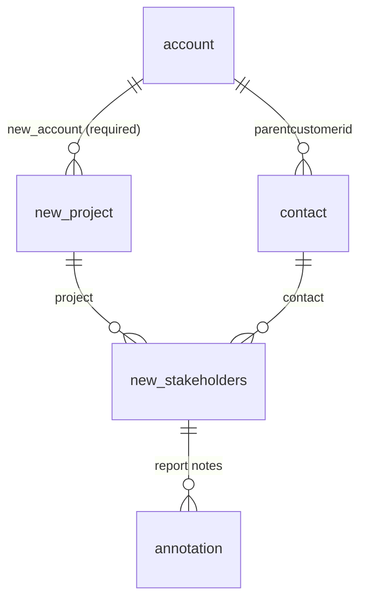
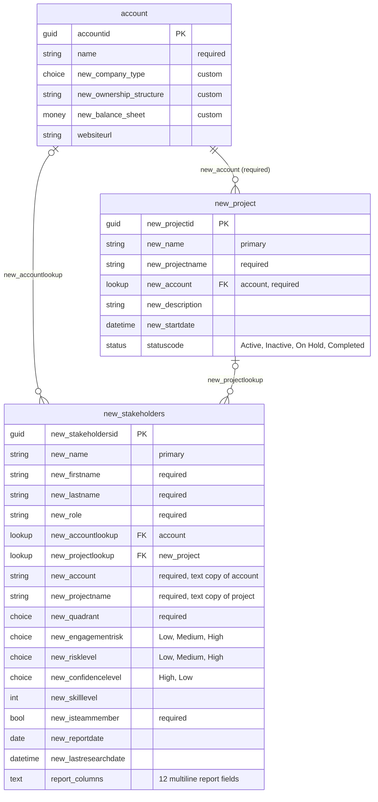

# Dataverse data model — solution "Stakeholders"

Environment `hackathon2-team2`, solution `Stakeholders` (publisher prefix `new_`).

## Target model (agreed 2026-09-25)

| Table | One row per | Holds |
|---|---|---|
| `account` (OOB) | customer | company data |
| `contact` (OOB) | person | identity only: name, job title, account, email — no profile content |
| `new_project` | project | name, account, dates, status |
| `new_stakeholders` — display name "Project Stakeholder" | person × project | contact, project, role in project, quadrant, engagement risk, confidence, report date, latest report HTML (for the canvas app) |
| `annotation` (Notes) | report run | dated HTML report attachment; history, never overwritten |

Front end: a Power Apps canvas app opened in Microsoft Teams by the PM. The report is
displayed with the HTML text control, so reports use inline styles only.
The model-driven app stays in the solution for now.

### Project Stakeholder columns (target)

| Column | Type | Status |
|---|---|---|
| `new_name` | Text, primary | exists |
| `new_contact` | Lookup → contact | added 2026-09-25 (make required in portal) |
| `new_projectlookup` | Lookup → new_project | exists (make required in portal) |
| `new_role_in_project` | Choice: Decision Maker, Sponsor, Influencer, End User, Blocker, Project Team Member | added 2026-09-25 |
| `new_quadrant` | Global choice | add "Not assessable", make optional (portal) |
| `new_engagementrisk` | Global choice | add "Not assessable" (portal) |
| `new_confidencelevel` | Choice: High, Medium, Low | Medium added 2026-09-25 |
| `new_reportdate` | Date only | exists |
| `new_report_html` | Multiline text, 1,048,576 | added 2026-09-25 |

All other custom columns on `new_stakeholders` are to be deleted in the portal (their
content lives in the HTML report, on contact, or on the project).

### Still to do in Dataverse

- Retire the custom profile columns on `contact` (`new_avoid`, `new_risk_level`, …).
- Delete `new_opportunitycontact` and the four old cloud flows (portal).

## Current model (read 2026-09-25, before the rework)

All tables are user-owned (`ownerid` → systemuser/team) with standard audit lookups.

## Open issues

- `new_stakeholders.new_account` / `new_projectname` are required text copies of the lookups and can drift.
- A stakeholder reaches an account directly and via its project; nothing enforces consistency.
- Schema vs. skill: `new_quadrant` has no "Not assessable" option and is required; `new_confidencelevel`
  lacks Medium; `new_skilllevel` cannot hold a range; `new_risklevel` and `new_engagementrisk` overlap.

## Outside the solution

- `contact` and `opportunity` were removed from the solution. Custom profile columns on contact
  still exist, and the flow "Save Stakeholder Profile to Dataverse" still writes to contact.
- `new_opportunitycontact` (contact × opportunity) is a custom table not in the solution; empty.
