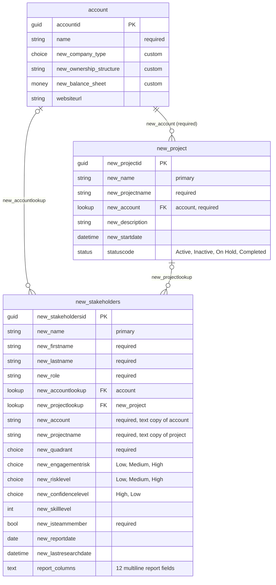

# Dataverse data model — solution "Stakeholders"

Environment `hackathon2-team2`, solution `Stakeholders` 1.0.0.0 (publisher prefix `new_`).
Read from the live environment on 2026-09-25.

All tables are user-owned (`ownerid` → systemuser/team) with standard audit lookups.

## Open issues

- `new_stakeholders.new_account` / `new_projectname` are required text copies of the lookups and can drift.
- A stakeholder reaches an account directly and via its project; nothing enforces consistency.
- Schema vs. skill: `new_quadrant` has no "Not assessable" option and is required; `new_confidencelevel`
  lacks Medium; `new_skilllevel` cannot hold a range; `new_risklevel` and `new_engagementrisk` overlap.

## Outside the solution

- `contact` and `opportunity` were removed from the solution. Custom profile columns on contact
  still exist, and the flow "Save Stakeholder Profile to Dataverse" still writes to contact.
- `new_opportunitycontact` (contact × opportunity) is a custom table not in the solution; empty.
